# 004_DOCUMENT_DEPENDENCY_GRAPH.md

> **Document:** Document Dependency Graph
>
> **Document ID:** 004
>
> **Version:** 1.0.0
>
> **Status:** Living Document
>
> **Owner:** Project Architect
>
> **Last Updated:** 2026-07-18

---

# Purpose

This document defines the dependency relationships between every major document in the Explorer Academy repository.

Unlike the Documentation Index, which describes *what* documents exist, this document describes **how documents depend upon one another**.

Its primary purpose is to ensure that:

- documentation is created in the correct order,
- architectural consistency is preserved,
- AI contributors understand prerequisite documents,
- changes are propagated safely,
- implementation never precedes architecture.

---

# Guiding Principles

Explorer Academy documentation follows five dependency rules.

1. Higher-level documents define intent.
2. Lower-level documents refine implementation.
3. Lower-level documents must never contradict higher-level documents.
4. Dependencies flow in one direction.
5. Circular dependencies are prohibited.

---

# Dependency Types

Every dependency should be classified using one of the following relationships.

| Relationship | Meaning |
|--------------|---------|
| Depends On | Cannot exist without another document |
| Influenced By | Uses guidance but not strictly required |
| References | May cite information |
| Generates | Produces downstream artifacts |
| Owns | Authoritative source |

---

# Repository Dependency Graph

```text
000 PROJECT MANIFEST
        │
        ▼
001 README
        │
        ▼
002 PROJECT CONTEXT
        │
        ▼
006 DESIGN DECISION LOG
        │
        ▼
003 DOCUMENTATION INDEX
        │
        ▼
004 DOCUMENT DEPENDENCY GRAPH
        │
        ▼
005 GENERATION ROADMAP
        │
        ▼
──────────────────────────────
          FOUNDATION
──────────────────────────────
                │
                ▼
101 PROJECT VISION
        │
        ▼
102 GUIDING PRINCIPLES
        │
        ▼
103 NORTH STAR
        │
        ▼
104 SUCCESS CRITERIA
──────────────────────────────
                │
                ▼
201 EDUCATIONAL PHILOSOPHY
        │
        ▼
202 LEARNING FRAMEWORK
        │
        ▼
203 CURRICULUM MAPPING
        │
        ▼
204 SKILL FRAMEWORK
        │
        ▼
205 ASSESSMENT STRATEGY
        │
        ▼
206 EXPLORER DEVELOPMENT MODEL
──────────────────────────────
                │
                ▼
301 PLATFORM ARCHITECTURE
        │
        ▼
302 UX GUIDELINES
        │
        ▼
303 MISSION SPECIFICATION
        │
        ▼
304 REWARD SYSTEM
        │
        ▼
305 PROGRESS SYSTEM
        │
        ▼
306 PARENT MODE
──────────────────────────────
                │
                ▼
401 CAMPAIGN TEMPLATE
        │
        ▼
402 MISSION TEMPLATE
        │
        ▼
403 WORKBOOK TEMPLATE
        │
        ▼
404 RABBIT HOLE LIBRARY
──────────────────────────────
                │
                ▼
501 CAMPAIGN 01
        │
        ▼
502 CAMPAIGN 02
        │
        ▼
503 CAMPAIGN 03
──────────────────────────────
                │
                ▼
601 HTML ARCHITECTURE
        │
        ▼
602 CSS GUIDELINES
        │
        ▼
603 JAVASCRIPT ARCHITECTURE
        │
        ▼
604 STATE MANAGEMENT
        │
        ▼
605 TESTING STRATEGY
        │
        ▼
606 DEPLOYMENT GUIDE
```

---

# Mermaid Dependency Diagram

```mermaid
flowchart TD

Manifest --> README
README --> Context
Context --> Decisions
Decisions --> Index
Index --> DependencyGraph
DependencyGraph --> Roadmap

Roadmap --> Vision
Vision --> Principles
Principles --> NorthStar
NorthStar --> Success

Success --> Education
Education --> Learning
Learning --> Curriculum
Curriculum --> Skills
Skills --> Assessment
Assessment --> Explorer

Explorer --> Platform
Platform --> UX
UX --> Mission
Mission --> Rewards
Rewards --> Progress
Progress --> Parent

Parent --> CampaignTemplate
CampaignTemplate --> MissionTemplate
MissionTemplate --> WorkbookTemplate
WorkbookTemplate --> RabbitHole

RabbitHole --> Campaign1

Campaign1 --> HTML
HTML --> CSS
CSS --> JavaScript
JavaScript --> State
State --> Testing
Testing --> Deployment
```



---

# Document Categories

The repository is divided into logical layers.

## Layer 0

Repository Foundation

Purpose

Defines the project itself.

These documents change very rarely.

---

## Layer 1

Vision

Purpose

Defines why the project exists.

---

## Layer 2

Educational Design

Purpose

Defines how learning happens.

---

## Layer 3

Platform Architecture

Purpose

Defines how the product works.

---

## Layer 4

Campaign Framework

Purpose

Defines reusable educational content.

---

## Layer 5

Campaigns

Purpose

Defines actual learning adventures.

---

## Layer 6

Engineering

Purpose

Defines implementation.

---

# Dependency Matrix

| Layer | May Depend On | Must Not Depend On |
|---------|---------------|--------------------|
| Foundation | None | Everything below |
| Vision | Foundation | Engineering |
| Education | Vision | Engineering |
| Architecture | Education | Implementation |
| Campaign Framework | Architecture | Engineering |
| Campaigns | Framework | Engineering |
| Engineering | Everything above | Nothing below |

---

# Change Impact Rules

Before modifying any document:

Determine:

- What documents depend on it?
- Does the change alter architectural intent?
- Does it invalidate downstream documents?
- Does an ADR need updating?

If the answer to any is **Yes**, review every downstream document before approving the change.

---

# AI Contributor Rules

AI contributors should always determine:

1. What documents are prerequisites?
2. What documents will be affected?
3. Does this introduce a circular dependency?
4. Does the dependency graph need updating?

Never generate a document whose prerequisites are incomplete.

---

# Future Expansion

New document categories should always be added as new layers.

Never insert documents that bypass existing architectural dependencies.

The dependency graph should remain acyclic.

---

# Validation Checklist

Before approving any new document:

- [ ] All prerequisite documents exist.
- [ ] Dependencies are declared.
- [ ] No circular references introduced.
- [ ] The Documentation Index has been updated.
- [ ] The Generation Roadmap reflects the change.
- [ ] Related ADRs have been reviewed.

---

# Guiding Principle

A contributor should be able to determine:

- **what to read,**
- **what to write next,**
- **what may safely change,**
- and **what must remain stable**

using this document alone.